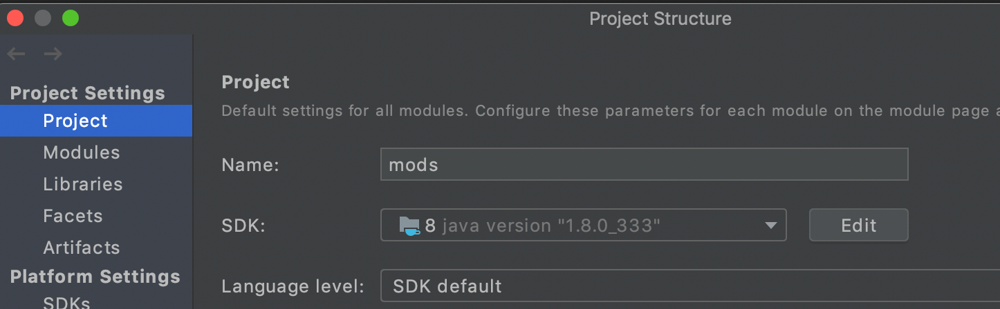

# Spiral Mods

Mods for the Spiral Knights.

## Usage

All mods need to be loaded using [projectx-hazard](https://github.com/spiralstudio/projectx-hazard) or [KnightLauncher](https://github.com/lucasluqui/KnightLauncher).

## Mods

- [Core](core) is the basis of all mods.
- [ShowPing](showping) enhances minimap to show ping value.
- [StayOnline](stayonline) guarantees not to be kicked out even after long idle time.
- [Pandora](pandora) is a full item arsenal, preview only.
- [PocketShop](pocketshop) calls shops anytime and anywhere.
- [Teleport](teleport) sends you to somewhere.
- [Camera](camera) allows you moving and rotating the camera.
- [AutoAdvance](autoadvance) automatically clicks the "Advance Now" button, removes "Prize Wheel" animations.
- [NoLoading](noloading) hides loading screen.
- [NoNews](nonews) hides news.
- [LootFilter](lootfilter) hides loot messages and pickup sprites.

## Installation

You can skip this step if you are good at Java.

### Download IntelliJ IDEA

https://www.jetbrains.com/idea/download/


Please choose to download the client corresponding to the OS,
usually we use the Community Edition is enough.

### Download repository

### Git

```shell
git clone https://github.com/spiralstudio/mods.git
```

After the download is complete, open the project with IntelliJ IDEA,
or click the `Get From VCS` button to download the repository.


## Build

### JDK

Please make sure your JDK version is `1.8`.

Open `Project Structure` to set up the JDK.




### Maven

Open the Maven panel and double-click `install` to build the project.


After the build is successful, you can find the jars in the target directory of each module.


## License

This project is under the MIT license. See the [LICENSE](LICENSE) file for details.